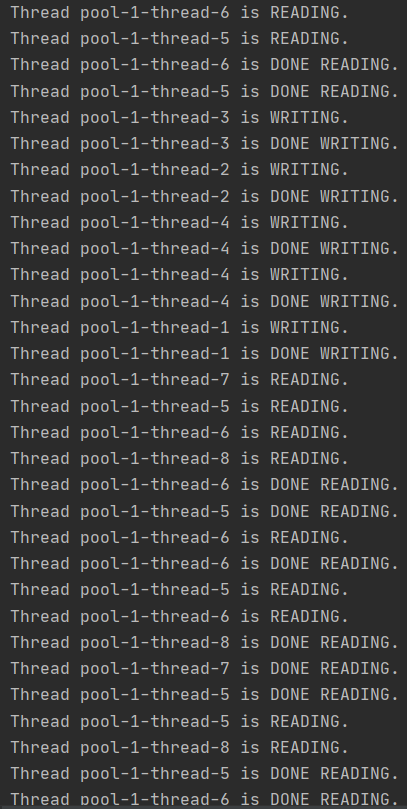

# The-Reader-Writer-Problem

This project is a solution to readers-writers problem in which several processes (readers and writers) are trying to access shared variables. JAVA
Obviously, if two readers access the shared data simultaneously, no adverse effects will result, hence, they are allowed to access. However, if a writer and some other process (either a reader or a writer) access the data simultaneously, chaos may ensue. To ensure that these difficulties do not arise, we require that the writers have exclusive access to the shared data while writing to the data.

• If a writer has begun writing process, then

o No additional writer can perform write function

o No reader is allowed to read

• If 1 or more readers are reading, then 

o Other readers may read as well

o No writer may perform write function until all readers have finished reading

<h3> OUTPUT </h3>

